# barch
Платформа для банкинга в рамках учебного проекта

## Домены

Домены новой банковской системы выделены следующие:

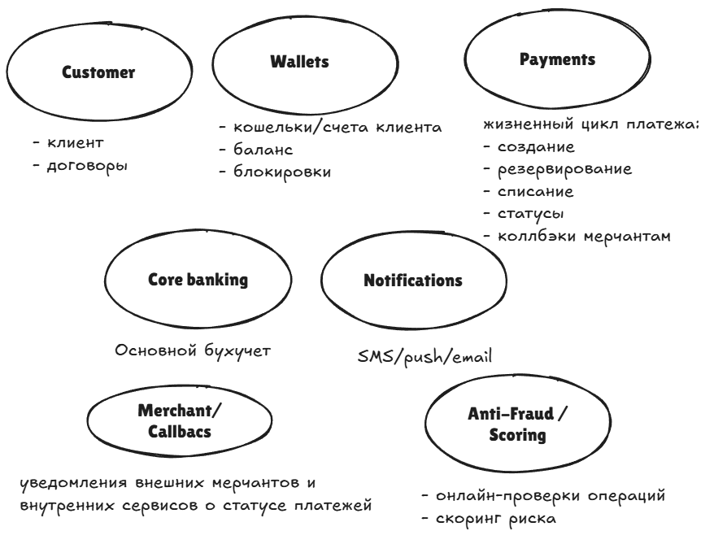

Отобразим связи между доменами:

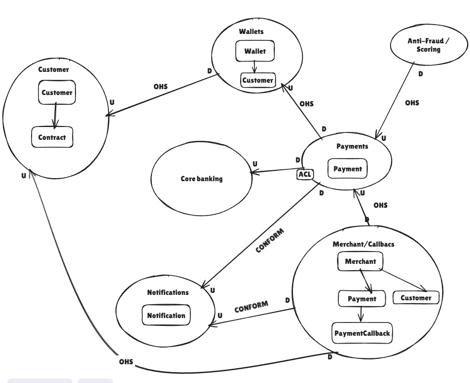

В plantuml упрощенно будет такая схема:

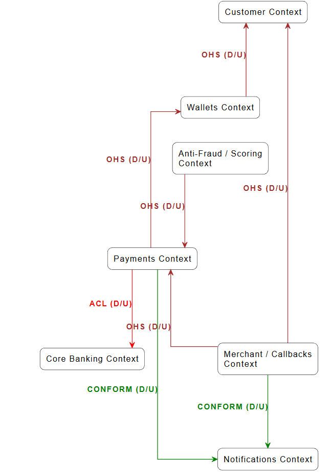

## Архитектурные диаграммы разных уровней
В документе диаграммы ниже будут представлены в миниатюре, по адресу [https://strelchm.github.io/barch/](https://strelchm.github.io/barch/) можно в динамике посмотреть на систему на разных уровнях и/или с разных сторон. Инструмент likeC4 выбран так как можно проваливаться в архитектуре либо выделять/ рассматривать отдельные компоненты, диаграммы As code.
### Context
Диаграмма контекстов позволяет верхнеуровнево посмотреть на решаемы нами процесс проведения платежей и место системы платежей среди других акторов.
В plantuml диаграмма следующая:
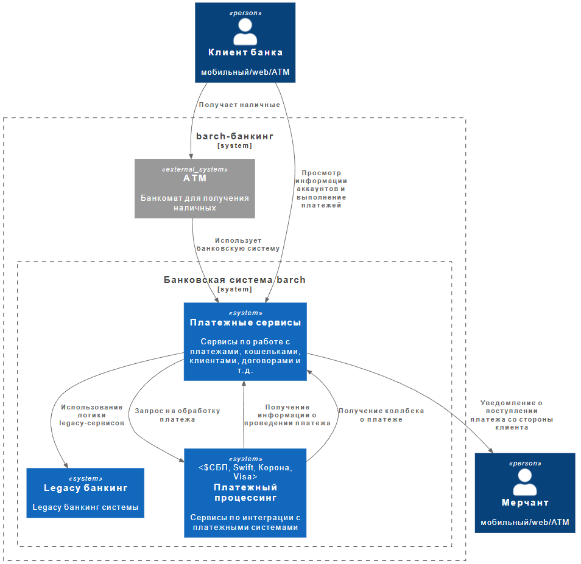

### Container V1
Рассмотрим диаграмму контейнеров системы, на первом этапе она было только в likec4:  
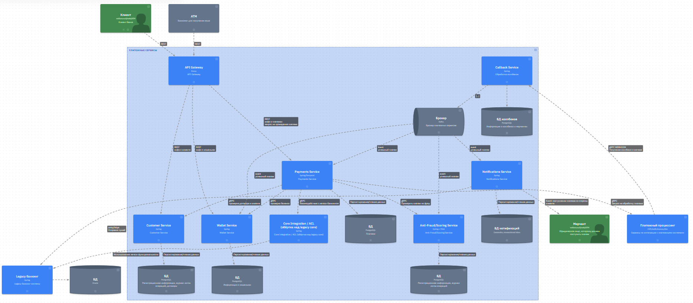

* Точка входа \- API gateway, BFF необходимо будет делать в будущей проработке, так как мобильный банкинг \- урезанная версия web-банкинга).  

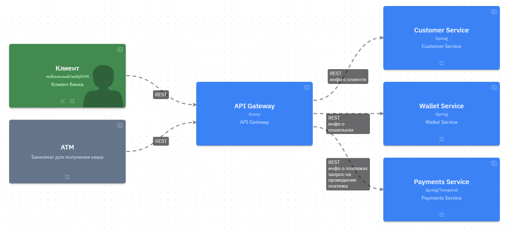

Клиент может посмотреть личную информацию, о платежах, кошельках в соответствующих сервисах по **REST *(необходимо синхронно в удобном формате для клиентов получить данные. При будущем выносе BFF возможно будет применен GraphQL)***.  
Ключевое требование к Gateway:

1. поддержка основных функций Service mash
* rate limiting
* маршрутизация по сервисам
* логирование/корреляция запросов
* Https терминация и OIDC (сервер авторизации в будущем будет дополнительным блоком)
2. большое горизонтальное масштабирование
3. высокая производительность, низний latency
По этим требованиям хорошо подходит Kong либо Envoj.

* Ключевой сервис \- платежей Payments, который персистирует информацию о платеже и отвечает сразу клиенту о том, что платеж принят в работу. Выполнение платежа происходит на Temporal (***асинхронная работа, durable execution***) \- шаги проходят проверку баланса в сервисе wallet, проверку договора в сервисе customer. Последний шаг перед отправкой \- проверить на антифрод в соответствующем сервисе. Все проверки в формате **GRPC *(что удовлетворяет требования по быстрому удобному синхронному вызову в моменте проверок)***. Далее шлется запрос платежный процессинг на проведение платежа. Несмотря на большое количество шагов в Temporal шаги распараллеливаются и скорость подобных проверок достаточно быстрая.

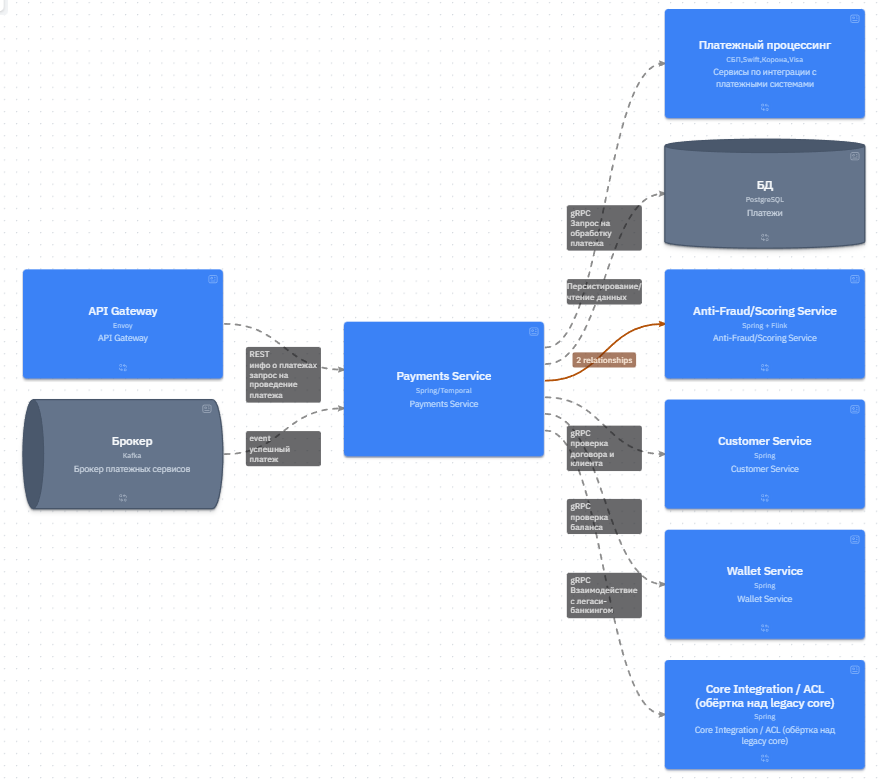

* Сервис антифрода получает события из брокера про попытки оплаты, а также другую информацию. Логика на Flink \- реалтайм потоки данных, которые персистируют стейт в PostgreSQL и принимают события из брокеров ***(асихронная обработка в риалтайме)***. Решение о разрешении платежа принимается на основе оконной статистики.

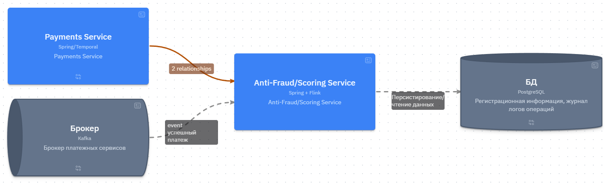

* Сервис коллбеков получает информацию от карточного процессинга ***(GRPC webhook, хотя событие в Kafka при наличии общего брокера между системами. Наверное, здесь одно из немногих мест, что и RabbitMQ можно затащить, что бы как можно быстрее принять ответ)*** и хранит данные о мерчантах (вынести в отдельный сервис?). Сервис отправляет событие о платеже в брокер, который рассчитывают другие сервисы \- так сервис кошельков обновляет баланс, сервис нотификаций отправляет уведомления через legacy банкинг ***(eventual consistency обновление вследствие события проведения платежа)***.

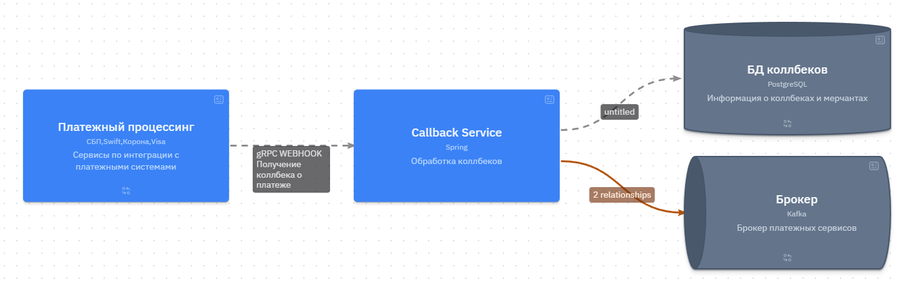

* Legacy банкинг \- другие сервисы банкинга, которые в режиме **Stranger** переписываются с монолита на микросервисы.

### Container V2
В версии 2 изменили синхронные проверки платежей на асинхронные проверки через брокер, durable-оркестратор оставили.

В plantuml схема выглядит следующим образом:

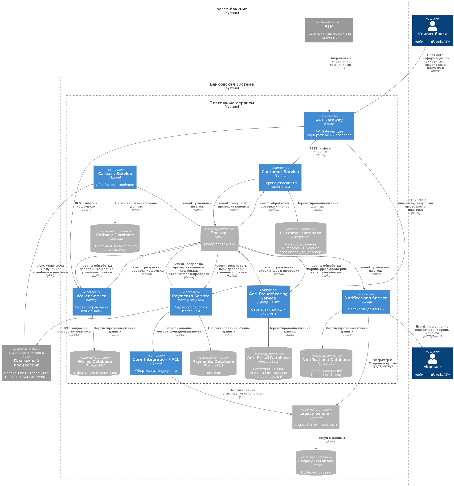

Как видно из диаграммы, связность сервисов уменьшилась за счет того, что коммуникация теперь через брокер:

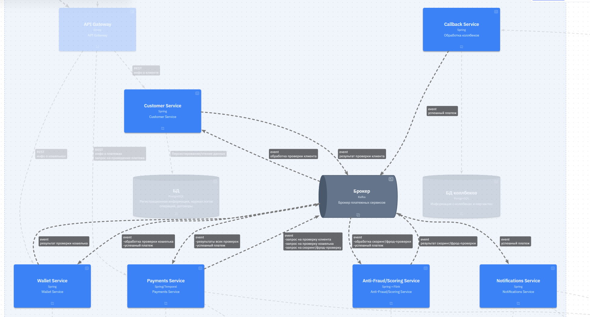

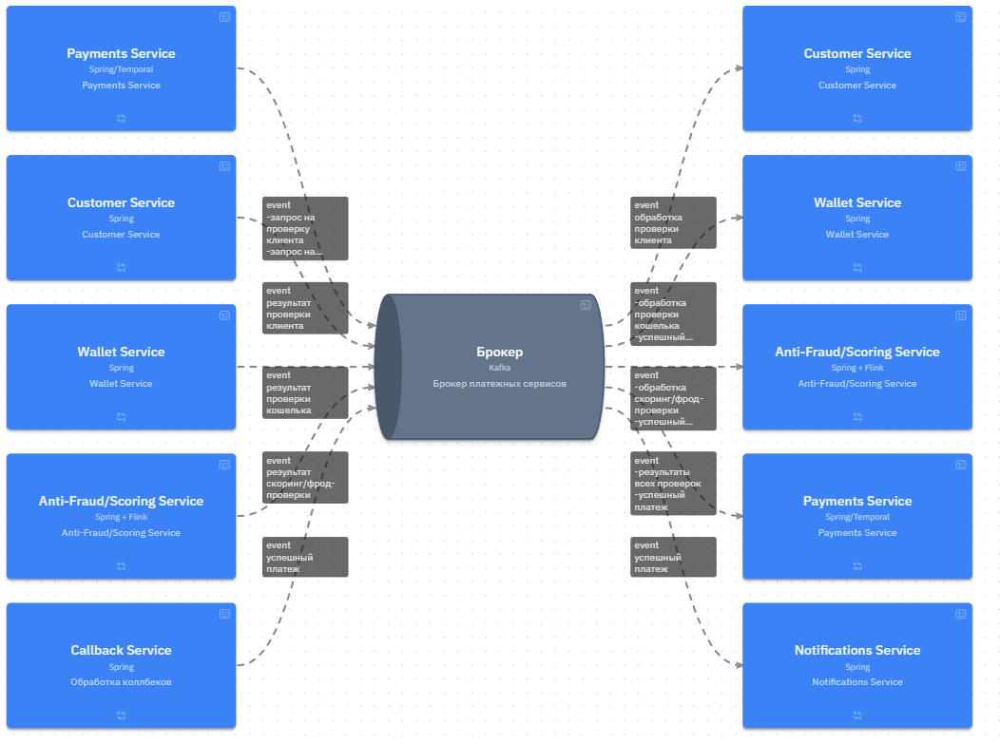

## Рассмотрение применимости брокеров
Для своей системы мы выбрали Kafka (нам очень важно масштабирование и другими недостатками - tradeoff), но варианты были рассмотрены разные. Рассмотрим возможные варианты реализации разных частей системы со стороны брокеров:

| Поток / сценарий | Брокер (Kafka / RabbitMQ / нет) | Тип сообщений (event / command / job) | Обоснование выбора  |
| ----- | :---: | :---: | ----- |
| PaymentCompleted → Notifications | Kafka | command  | универсальный компонент, который необходимо масштабировать. latency не сильно важно. Что может понадобиться от кролика \- приоритетность, но и то вряд ли |
| PaymentRequested → Anti-Fraud | Kafka | command  | Необходимо обрабатывать большое количество, latency отдельного не так важно как пропускная способность |
| Телеметрия/лог транзакций | Kafka | event | Лог событий, необходимо максимально масштабировать и, возможно, неодноразово вычитывать |
| Очередь генерации отчётов | RabbitMQ | command  | Небольшой поток, небольшое latency, умный fanout. Вычитывать повторно не надо |

## Идентификаторы

В barch мы выбираем [TSID](https://vladmihalcea.com/uuid-database-primary-key/) - одну из имплементаций Snowflake. Выбираем за счет небольшого размера по сравнению с UUID, идентификатор можно представлять как в числовой, так и текстовой форме. Сортируется по времени и содержит идентификаторы нод, что делает вероятность совпадения очень небольшой.

| Аспект                  |         Было (sequence)          |                   UUID v7                    | TCID                                                           |
|-------------------------|:--------------------------------:|:--------------------------------------------:|----------------------------------------------------------------|
| Генерация               |        В БД, узкое место         |      На каждом сервисе, без координации      | На каждом сервисе, без координации                             
| Локальность индексов    | Нормальная, но только в одной БД | Хорошая во всех БД, сортируемость по времени | Хорошая во всех БД, сортируемость по времени                   |
| Глобальная уникальность |               Нет                |                      Да                      | Да                                                             |
| Интеграции              |          Только numeric          |        UUID, нужен mapping для legacy        | numeric либо текстовое представление, нужен mapping для legacy |
| Размер                  |              64 bit              |                   128 bit                    | 64 bit                                                         |

Применение:
* в Payments DB - primary key, генерируется сервисом настройкой Hibernate либо использованием библиотеке-генератора.
* в Wallet соответствующие действия с кошельком содержат признаком идентификатор платежа - как в mdc и спанах, так и отдельным полем в операции с кошельком в БД.
* в событиях Kafka/Rabbit идет проливка события с соответствующим полем id-платежа - напр. событие в сервис антифрода.
* в логах и трассировке идентификатор является параметром, по которым будут искать наиболее часто цепочку операций при разборе кейсов и инцидентов.
* в callback-ах мерчантам тоже необходимо иметь связь с данным идентификтором - событие должно либо содержаться в коллбеке из процессинга (своего рода трейсинг вне платежной платформы) либо событийно нужно передавать сервису платежей идентификатор сервису коллбека?

Необходимо оставить старые идентификаторы рядом с новыми при миграции, так как сопоставление старых ид с новыми сложная миграция и не факт что ее можно решить тривиальными способами. Функционал получения старых платежей должен быть локализирован в нескольких местах - например, получение архивной информации либо получение истории платежей. Со стороны клиентов не важно - новый идентификатор или старый, только сервис платежей понимает логику идентификаторов.